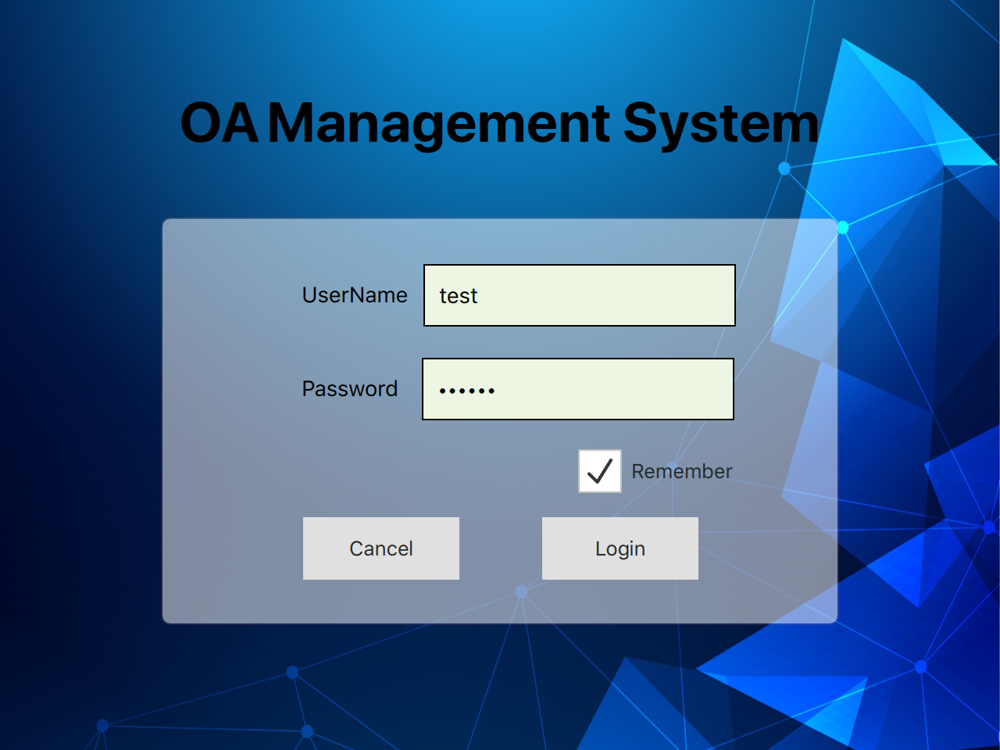
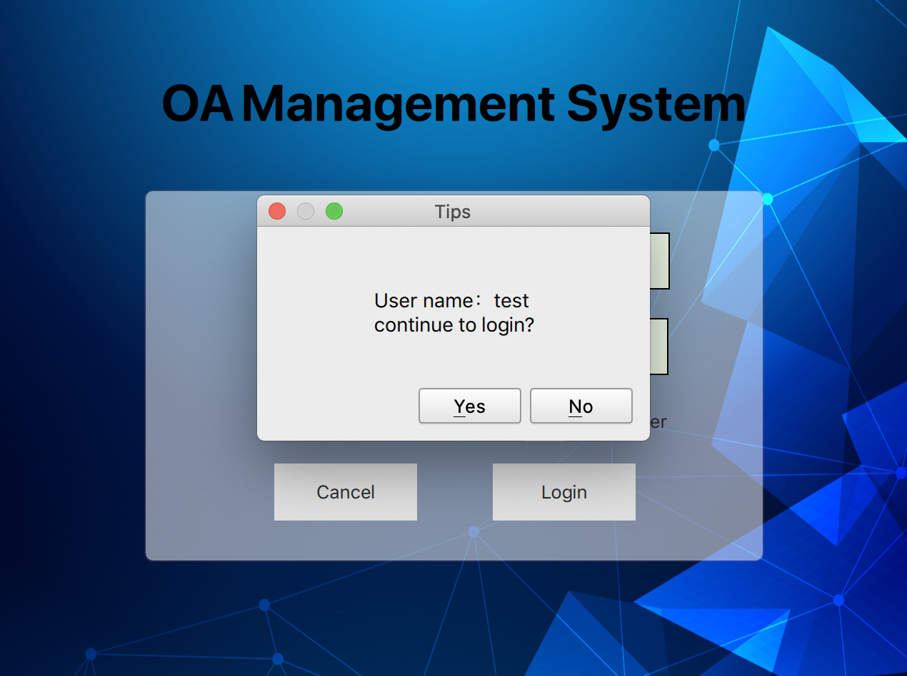
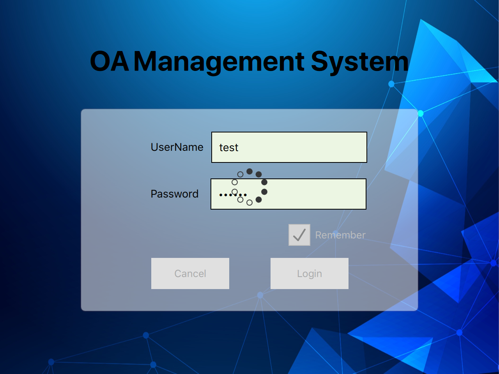
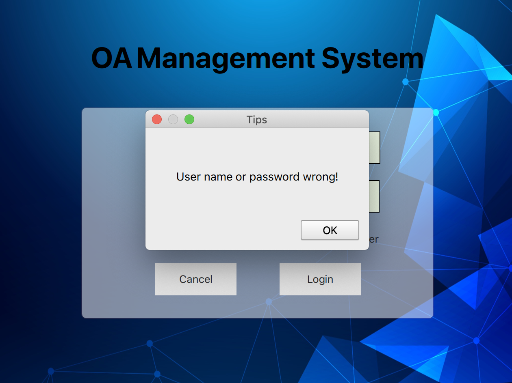

Golang develop cross platform software，based on Golang+Qt,

using the library of <https://github.com/therecipe/qt>

## Run

1. Configure the development environment with reference to <https://github.com/therecipe/qt>
1. Download the code, run ` qtdeploy test desktop`

## Preview screenshot

